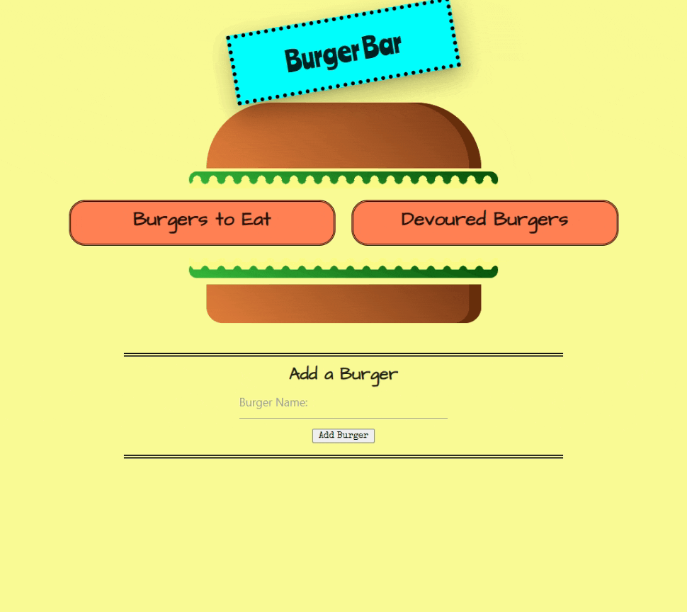

# Log That Burger!
[](http://unlicense.org/)

## Description
Live vicariously through your fingers!

A calorie free, mess free way to dream up your favorite burger combinations and eat them all you want!

This application allows the user to visit a virtual burger bar to create, devour and delete burgers.

### Built With
- [Node.js](https://nodejs.org/)
- [Express](https://expressjs.com/)
- [Handlebars](https://handlebarsjs.com/)
- [MySQL](https://dev.mysql.com/doc/)
- [Nodemon](https://www.npmjs.com/package/nodemon)
- [Materialize](https://materializecss.com/)

[Link to Deployed Project](https://still-shelf-27368.herokuapp.com/)

### Demo



## Table of Contents
1. [Installation](#installation)
2. [Usage](#usage)
3. [License](#license)
4. [Contributing](#contributing)
5. [Tests](#tests)
6. [Questions](#questions)
7. [Credits](#credits)


## Installation
To install the necessary dependencies, run:
```
npm install
```


## Usage
To use the app:
* Go to the delpoyed app, input burgers you'd like to eat, and click ```Create Burger```.
* Once you crete a burger, you can eat it or delete it. If you eat it, it will move to the Devoured Burgers column. If you want to eat it again, simply click the ```Regurgitate``` button... just like a cow!

To install the app locally:
* After cloning the repository and installing dependencies, use the schema.sql file to create a database locally.
* Run ```node server```.
* Note: you'll need to have Node and MySQL installed on your computer.


## License
This project is licensed under the **unlicense** license.


## Contributing
Have an idea for an improvement? Is something not working properly? Please submit an issue on GitHub. If you see an issue that you'd like to work on, shoot me an email or just submit a pull request.


## Tests
There are currently no tests for this project.


## Questions
If you have any questions about this project or repository, please open an issue or contact me at [molly.kizer@gmail.com](mailto:molly.kizer@gmail.com).

You can find more of my work at GitHub under my username [LivesInRoom29](https://github.com/LivesInRoom29).


## Credits
* Creation of the burger parts is thanks to two YouTube videos:
    * [CSS Burger Tutorial](https://www.youtube.com/watch?v=Lm_swJhK7Xw) from Academinf
    * [CSS Wavy Border](https://www.youtube.com/watch?v=KyxtQ_9aSw0) from zFunx Web Development Ideas
* Thanks to the UNH Bootcamp instructor, TAs, and tutors for the great instruction, resources, and support.
* Thanks to my classmates for the study groups, helping to troubleshoot and for sharing awesome resources and questions.
